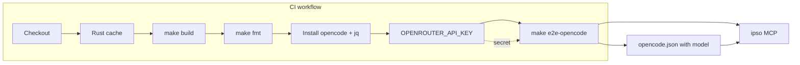

# GitHub workflow validation and OpenRouter E2E setup

## 1. Add `make fmt` target

In [Makefile](Makefile):

- Add `fmt` to `.PHONY` and to the help text.
- New target: `fmt` running `cargo fmt -- --check` so CI fails when code is not formatted (no file changes).

## 2. Configure E2E to use OpenRouter (openrouter/openrouter/free)

**Generated opencode.json**

[Makefile](Makefile) currently writes `sample-project/opencode.json` in `setup-sample-project` with only MCP config. Extend that JSON to include model and OpenRouter provider so OpenCode uses OpenRouter headlessly. Use this verified working shape:

- `"model": "openrouter/openrouter/free"` (free-tier model via OpenRouter).
- `"provider": { "openrouter": { "options": { "apiKey": "{env:OPENROUTER_API_KEY}" } } }` so the API key is supplied via env (no `/connect` or auth.json). OpenCode resolves `{env:VAR}`; ensure `OPENROUTER_API_KEY` is exported in the shell that runs opencode (e2e script sources `.env` with `set -a` so vars are exported).

**API key source**

- **CI:** Store the key in GitHub secret `OPENROUTER_API_KEY`; workflow exports it when running `make e2e-opencode`.
- **Local:** Keep using [.env](.env) (already gitignored). E2E script must **source and export** (e.g. `set -a; . "$REPO_ROOT/.env"; set +a`) so the var is in the environment of the `opencode` process.

**E2E script change**

In [scripts/opencode-e2e.sh](scripts/opencode-e2e.sh): before `cd "$SAMPLE_PROJECT"`, if `REPO_ROOT/.env` exists, source it (e.g. `set -a; . "$REPO_ROOT/.env"; set +a` or equivalent) so local dev gets `OPENROUTER_API_KEY` from `.env`; CI will rely on the workflow setting the env var.

## 3. GitHub Actions workflow

Create `.github/workflows/ci.yml` (or `validate.yml`) with:

**Triggers**

- Run the workflow on **pull requests** (e.g. `pull_request`) and on **push to main** (e.g. `push: branches: [main]`). Example: `on: [pull_request, push]` with `push` restricted to `branches: [main]`, or separate `pull_request` and `push: branches: [main]`.

**Environment**

- Set **`environment: test`** on the job that runs e2e (or on the workflow). The `OPENROUTER_API_KEY` secret is stored under the **test** GitHub environment, so the job must use that environment to access it.

**Rust cache**

- Use `Swatinem/rust-cache` (or `actions/cache` with a key derived from `Cargo.lock` and restore path `target/`). Optionally include `~/.cargo/registry` and `~/.cargo/git` in the cache for faster dependency restore.
- No `rust-toolchain` file in the repo; use the default stable toolchain from `dtolnay/rust-toolchain` or `actions-rs/toolchain` (stable) or the standard `actions/checkout` + manual `rustup default stable` if preferred.

**Job steps (high level)**

1. Checkout repo.
2. Set up Rust (stable) and restore Rust cache (dependencies + `target/`).
3. Run `make build`.
4. Run `make fmt`.
5. Install OpenCode: `curl -fsSL https://opencode.ai/install | bash`.
6. Install `jq` if not present (e.g. `sudo apt-get install -y jq` on Ubuntu runners; often already present).
7. Export `OPENROUTER_API_KEY` from the **test** environment secret: ensure the job has `environment: test` and set `OPENROUTER_API_KEY: ${{ secrets.OPENROUTER_API_KEY }}` for the step (or job) that runs e2e.
8. Run `make e2e-opencode`.

**Opencode installation note**

- Run `curl -fsSL https://opencode.ai/install | bash`. No separate auth step is needed: the generated `opencode.json` (from `setup-sample-project`) configures the OpenRouter provider with `apiKey: "{env:OPENROUTER_API_KEY}"`, and the workflow passes the secret as that env var for the e2e step.

**Secret**

- The `OPENROUTER_API_KEY` secret is configured in the **test** GitHub environment. The job that runs e2e must specify `environment: test` so it can access that secret. Document in the workflow or README that the test environment must have `OPENROUTER_API_KEY` set. No code change for "assuming it's done" locally.

## 4. Order of execution

Workflow should run: `make build` → `make fmt` → `make e2e-opencode`. The Makefile already has `e2e-opencode` depending on `setup-sample-project`, which depends on `build`; so a single `make e2e-opencode` would run build and setup first. To keep steps explicit and fail fast on fmt, run three separate make invocations: `make build`, `make fmt`, then `make e2e-opencode` (e2e will no-op build/setup if already done).

## 5. Copy plan to specs/ (when implementing)

**When implementing this plan**, copy this plan into the repo at **specs/** so the design is versioned with the code (same pattern as [specs/opencode-e2e-functional-tests.md](specs/opencode-e2e-functional-tests.md)). Create `specs/github-ci-and-openrouter-e2e.md` with the plan content. This is a required step of implementation.

## 6. Files to add or change

| Item                                               | Action                                                                                                                                                                                                                                                |
| -------------------------------------------------- | ----------------------------------------------------------------------------------------------------------------------------------------------------------------------------------------------------------------------------------------------------- |
| [Makefile](Makefile)                               | Add `fmt` target; extend `setup-sample-project` so generated `opencode.json` uses `"model": "openrouter/openrouter/free"` and `"provider": { "openrouter": { "options": { "apiKey": "{env:OPENROUTER_API_KEY}" } } }` (plus existing MCP).            |
| [scripts/opencode-e2e.sh](scripts/opencode-e2e.sh) | Source `REPO_ROOT/.env` when present so local runs get `OPENROUTER_API_KEY`.                                                                                                                                                                          |
| `.github/workflows/ci.yml`                         | New file: triggers `on: pull_request` and `push: branches: [main]`; checkout, Rust cache, `make build`, `make fmt`, install opencode + jq, job with `environment: test` and `OPENROUTER_API_KEY` from that environment's secret, `make e2e-opencode`. |
| `specs/github-ci-and-openrouter-e2e.md`            | **When implementing:** copy this plan into the repo at specs/ so the design is versioned with the code.                                                                                                                                               |

## 7. Diagram

## 8. OpenCode model

Use **openrouter/openrouter/free** as the `model` and `provider.openrouter.options.apiKey: "{env:OPENROUTER_API_KEY}"` in the generated `opencode.json` (verified working).
